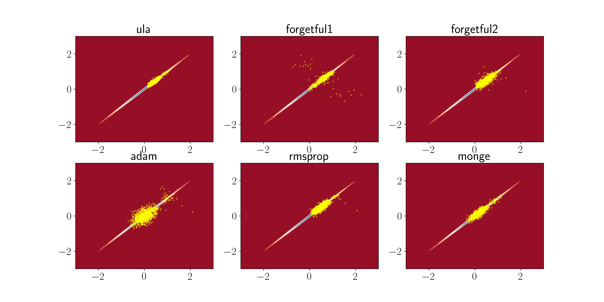

# AdaptiveGradientSamplers  

> Recent developments in Diffusion Probabilistic Models (DPMs) and in particular Score-based Generative Models(SGMs) have shown that improvement in speed and sample quality can be gained by adopting techniques such as preconditioned Langevin dynamics (LD) from computational statistics. (The full report can be found [here](https://isomorphicdude.github.io/assets/Draft.pdf))

We investigate the performance of pSGLD and its variants in sampling tasks. We measure the result in Wasserstein-2 distance and provide qualitative results. 

To replicate the experiments, run the file `main.py`.  

An example output is presented below.

For experiments on the SGM, code can be found in forked repositories. 
